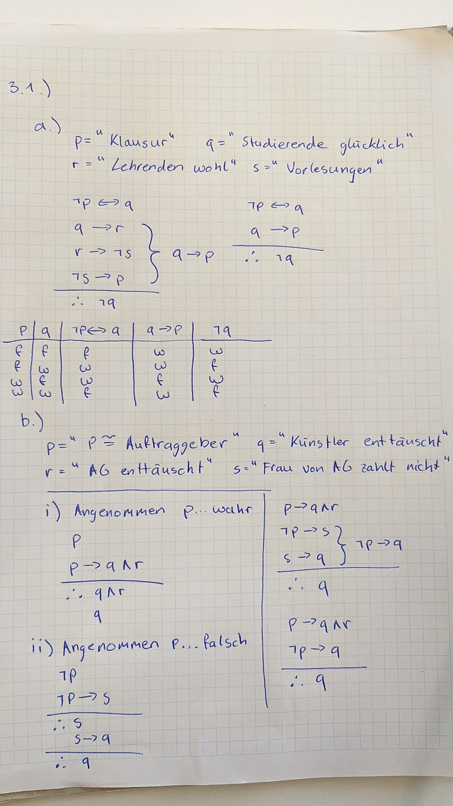
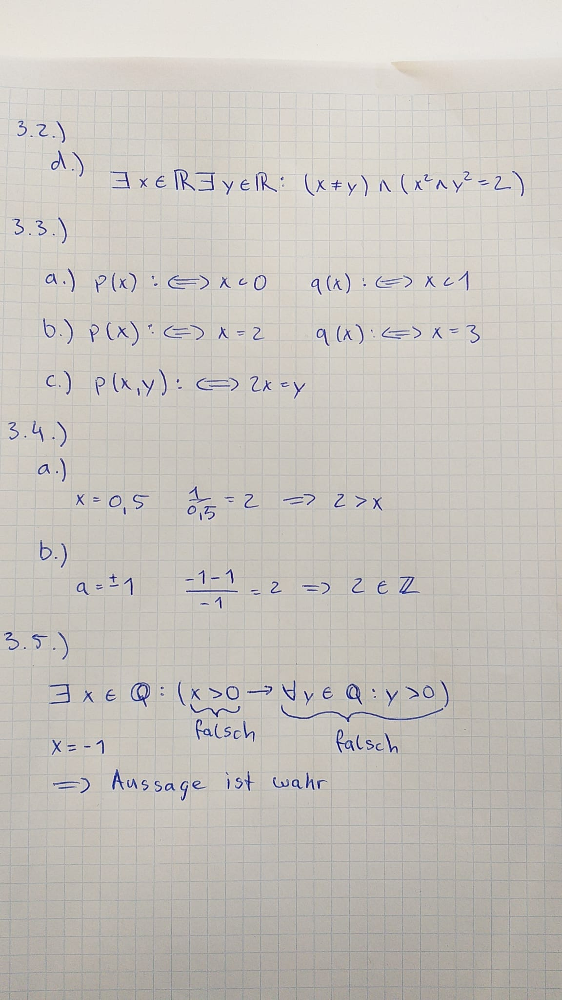

# Übungsblatt 03

## 3.2.)

a) `Für alle x ellement aus Rationalen Zahlen existiert ein y ellement aus den Natürlichen Zahlen bei dem das y größergleich x ist.`

b) `Für alle x ellement aus Reelen Zahlen gilt, wenn das x zum quadrat gleich 2 ist dann ist das x kein element aus den Rationalen Zahlen.`

c) `Für alle x element aus Rastionalen Zahlen für alle y element aus Ganzen Zahlen gilt, wenn x kleiner y dann existiert ein z element aus Rationalen Zahlen bei dem das x kleiner z ist z kleiner y ist. `

