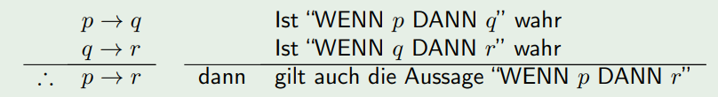

# Diskrete Strukturen Cheat Sheet

* [Documentation...](https://moodle.jku.at/jku/pluginfile.php/7966747/mod_resource/content/8/DiskreteStrukturen_1.pdf)

## Aussagen

#### Negation von Aussagen

|          | p  | ¬p | ¬(¬p)|
|:--------:|:--:|:--:|:----:|
| 1. Fall  | w  | f  | w    |
| 2. Fall  | f  | w  | f    |

#### UND- und ODER-Aussagen

| p  	| q  	| p ∧ q | p ∨ q |
|:-----:|:-----:|:-----:|:-----:|
| w  	| w  	| w  	| w  	|
| w  	| f  	| f  	| w  	|
| f  	| w  	| f  	| w  	|
| f  	| f  	| f  	| f  	|

#### Exklusiv-ODER (XOR)

| p  | q  | p ⊻ q |
|:--:|:--:|:-----:|
| w  | w  | w     |
| w  | f  | f     |
| f  | w  | f     |
| f  | f  | f     |

#### WENN-DANN und GENAU-DANN, WENN

| p  	| q  	| p → q | p ↔ q |
|:-----:|:-----:|:-----:|:-----:|
| w  	| w  	| w  	| w  	|
| w  	| f  	| f  	| f  	|
| f  	| w  	| w  	| f  	|
| f  	| f  	| w  	| w  	|

## Darstellung

* Implikation `p → q ⇔ ¬p ∨ q`
* Negation der Implikation `¬(p → q) ⇔ (p ∧ ¬q)`
* XOR `p ⊻ q <=> (p ∨ q) ∧ ¬(p ∧ q)`
* Duale Formel `(p ∧ ¬q) ∨ (r ∧ ⊥) ⇔ (p ∨ ¬q) ∧ (r ∨ ⊤)`
* Kontraposition `¬q → ¬p ⇔ p → q`
  
## Aussagenlogische Gesetze

## Typen Logischer Schlussweisen
* Syllogismus (Kettenschluss)
